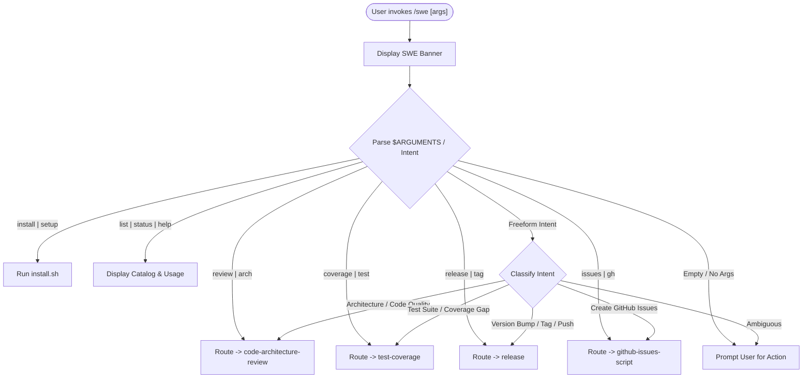

# SWE Skills Master Router (`/swe`)

The central command router and dispatcher for the **Software Engineering Skills (`swe-skills`)** suite. Directs explicit subcommands or freeform engineering intents to the appropriate specialized skill.

---

## Agent Detection & Mode Tuning

| Agent / Environment | Invocation Mechanism |
| :--- | :--- |
| **Antigravity (`agy`)** | Triggered via `/swe` slash command or natural language. Uses native file tools, subagents, and artifact generation. |
| **Claude Code** | Triggered via `/swe [subcommand] [args]`. Parses `$ARGUMENTS` and seamlessly executes the target skill workflow. |
| **Cursor (Composer / Agent)** | Triggered via `@swe` or prompt. Routes to the appropriate `.cursor/rules/*.mdc` or skill instructions. |
| **Universal AI Agents** | Standard CLI / markdown router with interactive fallbacks. |

---

## Routing Table & Subcommand Map

| Subcommand / Alias | Target Skill | Primary Purpose |
| :--- | :--- | :--- |
| `review`, `arch`, `architecture`, `audit` | **`code-architecture-review`** | Multi-tiered code & architecture review, Graphify/AST mapping, and 5-section improvement plan. |
| `coverage`, `test`, `tests`, `cov` | **`test-coverage`** | Real coverage audit across 10 ecosystems, deterministic static analysis, and prioritized gap plan. |
| `release`, `tag`, `version`, `semver`, `publish` | **`release`** | SemVer 2.0.0 bump calculation, `CHANGELOG.md` generation, annotated git tagging, and remote push. |
| `issues`, `gh`, `github`, `tickets` | **`github-issues-script`** | Transform review findings into executable, reviewable `scripts/create_issues.sh` via `gh` CLI. |
| `install`, `setup` | **Installer Tooling** | Run `./install.sh` to install SWE skills globally or locally for agy, claude, and cursor. |
| `list`, `status`, `help`, `?` | **Status / Menu** | Display skills catalog, active configuration, and quick start guide. |

---

## Router Workflow



---

## Step 0: Display Banner

**Before executing tool calls**, display the router header:

```text
========================================================
             SWE > SOFTWARE ENGINEERING SUITE           
========================================================
```

---

## Step 1: Parse Arguments & Classify Intent

Examine `$ARGUMENTS` or the user's prompt text:

### 1.1 Explicit Subcommand Matching

1. **`review` / `arch` / `architecture` / `audit`**:
   - Read and immediately execute [`skills/code-architecture-review/SKILL.md`](file:///Users/bill/src/swe-skills/skills/code-architecture-review/SKILL.md).
   - Forward any scoping arguments (e.g. `/swe review src/core`).

2. **`coverage` / `test` / `tests` / `cov`**:
   - Read and immediately execute [`skills/test-coverage/SKILL.md`](file:///Users/bill/src/swe-skills/skills/test-coverage/SKILL.md).
   - Forward test path or flags (e.g. `/swe coverage --unit`).

3. **`release` / `tag` / `version` / `semver`**:
   - Read and immediately execute [`skills/release/SKILL.md`](file:///Users/bill/src/swe-skills/skills/release/SKILL.md).
   - Forward bump flags (e.g. `/swe release --minor`, `/swe release --dry-run`).

4. **`issues` / `gh` / `github` / `tickets`**:
   - Read and immediately execute [`skills/github-issues-script/SKILL.md`](file:///Users/bill/src/swe-skills/skills/github-issues-script/SKILL.md).
   - Forward source plan path if provided (e.g. `/swe issues docs/ARCHITECTURE_REVIEW.md`).

5. **`install` / `setup`**:
   - Run the universal installer:
     ```bash
     ./install.sh "$@"
     ```

6. **`list` / `status` / `help` / no arguments**:
   - Display the Quick Menu (Step 2).

### 1.2 Freeform Natural Language Intent Routing

If no explicit subcommand matches, analyze the user's natural language goal:

- If the user asks about: *design flaws, circular dependencies, coupling, God objects, refactoring plan, AST mapping, architecture diagrams* $\rightarrow$ **Route to `code-architecture-review`**.
- If the user asks about: *untested functions, code coverage, bats tests, pytest coverage, lcov, test gap analysis* $\rightarrow$ **Route to `test-coverage`**.
- If the user asks about: *tagging a release, semver bump, changelog generation, git push tags, releasing a new version* $\rightarrow$ **Route to `release`**.
- If the user asks about: *creating GitHub issues from findings, batch tickets, gh issue script* $\rightarrow$ **Route to `github-issues-script`**.

---

## Step 2: Quick Menu & Status Display

When invoked without arguments or with `help`/`list`, output:

```text
Available SWE Subcommands:

  • /swe review [path]      Conduct comprehensive architecture & code review (Graphify/AST)
  • /swe coverage [opts]    Audit test suite & produce real coverage / gap-closing plan
  • /swe release [bump]     Calculate SemVer bump, update CHANGELOG, tag, and push
  • /swe issues [plan.md]   Generate reviewable batch GitHub issue creation script
  • /swe install [opts]     Run multi-agent installer (agy, claude, cursor)

Quick Examples:
  /swe review               # Run full repo architecture review
  /swe coverage             # Analyze test coverage & untested critical paths
  /swe release --minor      # Perform a minor release bump & push
  /swe issues               # Turn latest review findings into GitHub issues
  /swe install --global     # Install all skills globally
```

---

## Router Best Practices

1. **Zero Latency**: Route immediately to the target skill without unnecessary confirmation if the subcommand or intent is clear.
2. **Preserve Context**: Pass all trailing arguments and flags down to the target skill.
3. **Graceful Fallback**: If the intent is ambiguous, present the interactive menu rather than guessing.
